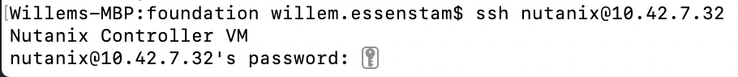
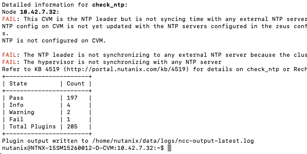
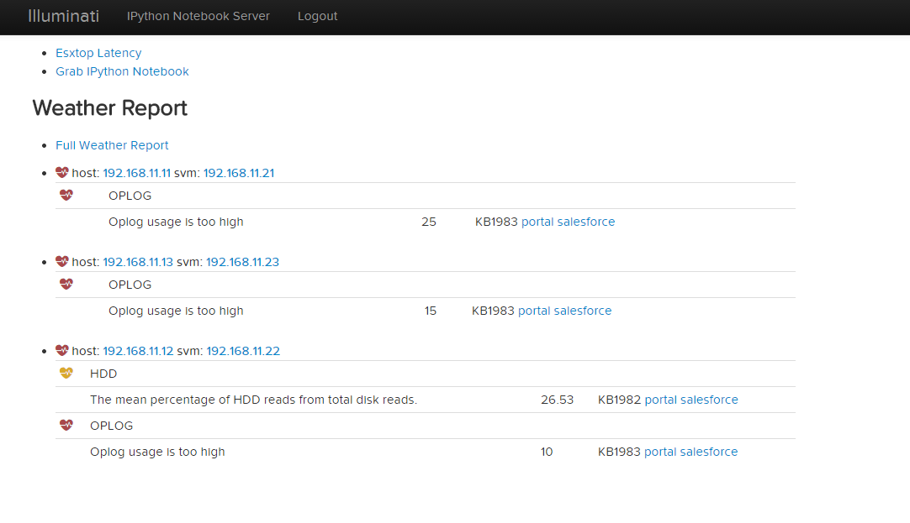
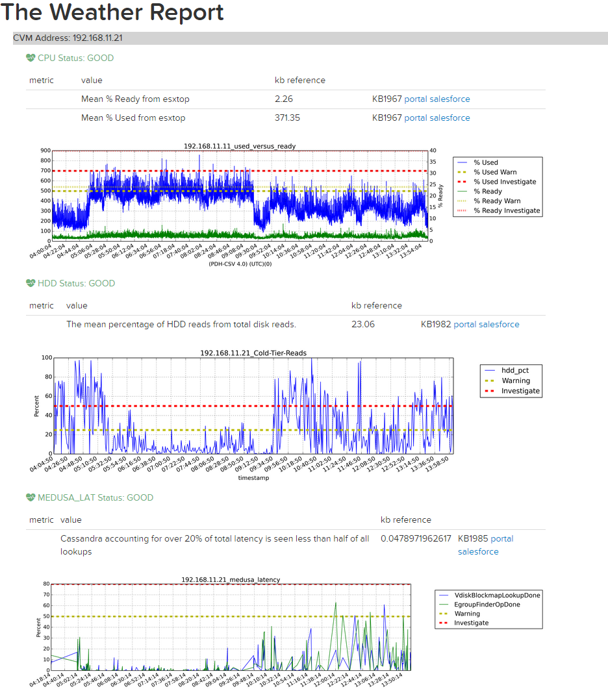

.. _ncc_cmdl:

----------------
NCC Command line
----------------

For this part of the lab we are going to run NCC again, but now from a command line. Also we will have a look at what needs to be run to collect log information if a case is opened by the customer and our SREs are asking for a collection of the logs.
At the end we're going to show what our SREs might do with the received data.

References
..........

- `Acropolis Command Reference > Controller VM Commands > ncc <https://portal.nutanix.com/#/page/docs/details?targetId=Command-Ref-AOS-v58:aut-ncc-crg-auto-r.html>`_
- `KB1406 Log Collector Usage <https://portal.nutanix.com/#/page/kbs/details?targetId=kA0600000008cPfCAI>`_
- `KB1993 How to use collect_perf to capture performance data <https://portal.nutanix.com/#/page/kbs/details?targetId=kA0600000008hQVCAY>`_

Additional Resources
....................

The following links are provided for reference and not required to complete the lab exercise.

- `SRE Bootcamp Training Materials <https://confluence.eng.nutanix.com:8443/pages/viewpage.action?spaceKey=~stephan.mercato&title=%5BBootcamp%5D+-+Acropolis+Architecture>`_ - *Great supplemental Nutanix architecture information*
- `SRE Technical Communities Wiki <https://confluence.eng.nutanix.com:8443/display/STK/Technical+Communities>`_ - *Support documentation on Hypervisors, Core AOS, Core Data Path, Performance, Prism, Tools, and Emerging Technologies.*

NCC command line
++++++++++++++++

Open a SSH connection to cluster you created earlier. Using the default username and password combination of **nutanix** and **YOUR SET PASSWORD DURING RX MANAGER MODULE**.

To be 100% sure you are a CVM, after a ssh connection the CVM will tell you you are about to login to the CVM by stating a line:"Nutanix Controller VM".

At the command line type **ncc** and hit the enter key. This will bring up a table of all the modules that NCC can run. As we are going to run the same tests as we did in the NCC UI module, Type

.. code-block:: bash

  ncc health_checks run_all

This will run exactly the same tests as you have run earlier from the Prism UI. Wait until the NCC has run all before moving to the next step.

The resulting table provides an overview off **Pass, Info, Warning, Fail** and amount of **Total Plugins** that where used. If there are issues found, including Info, there will be a KB mentioned to point toward a possible solution.

Don't close the ssh connection as we need it in the following part of this module..

collect_perf
++++++++++++

**What is collect_perf?**

*collect_perf is a utility used to capture performance data from a Nutanix cluster.*

**When would I run collect_perf?**

*collect_perf would typically only be run under the guidance of Support or Performance Engineering in supporting a performance issue. This exercise is more about awareness.*

*After gathering information on the specific performance issue from the customer and reviewing the relevant performance data available in the Prism Analysis page, if the issue cannot be resolved by live troubleshooting, or if the issue is not immediately reproducible, you can gather performance data by using the collect_perf utility.*

*It is critical that you collect data that covers a time when a given customer complaint is being experienced.  Ensure that you work with the cluster administrator to define when the utility will be started and stopped and have them provide information on what occurred during the window.*

*The collect_perf is generally safe to run, however in some circumstances it may be desirable to reduce the dataset collected to reduce overhead. Significant CPU consumers such as activity traces and vdisk stats may need to be excluded in such cases where CPU usage may already be high on a given CVM and/or its corresponding host.*

------------

if you have close the ssh connection connect to your CVM.

To start collecting performance stats, execute the following:

``nutanix@CVM$ collect_perf start``

.. note::

  By default, collect_perf will only allow the output file to grow to 20% of available capacity on the CVM from which it is being run. This is why it's important to define the window during which the performance degrading event is expected to occur.

  The CVM's `crontab <https://en.wikipedia.org/wiki/Cron>`_ can be leveraged to start and stop collect_perf at pre-determined times.

To verify collection is running, execute the following:

``nutanix@CVM$ tail data/performance/run/collect_perf.log``

After the desired event has been captured, stop collect_perf by executing the following:

``nutanix@CVM$ collect_perf stop``

.. note::

  It can take up to 20 minutes to stop the collect_perf process.

After data collection has stopped, the output .tgz file will be available in /home/nutanix/data/performance.

------------

**So what does support do with these things?**

*Performance cases do not always fall into a typical "break-fix" category, and are often complex in nature. Additionally, analyzing performance data collected for these cases can be time consuming, and complicated. Performance data bundles are first uploaded to an internal server called `Illuminati <http://illuminati.corp.nutanix.com>`_ where the data will be automatically checked for common performance issues.*

*The resulting report, called the Weather Report, provides key details regarding CPU usage, Oplog usage, Medusa (metadata) latency, and cold tier (HDD) reads to can be used to pinpoint the cause of a given performance issue.*

