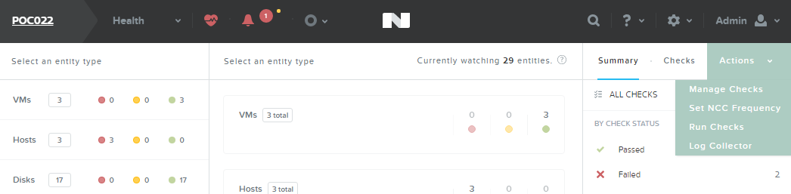
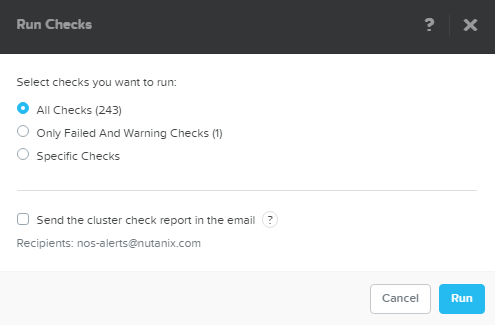
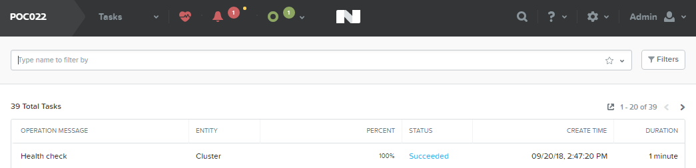
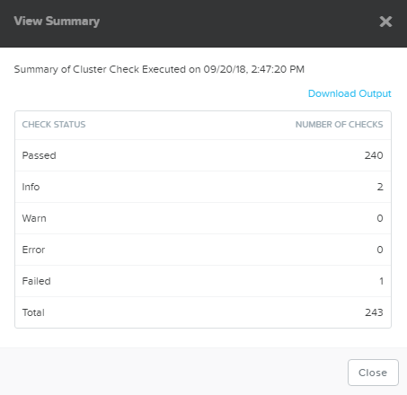
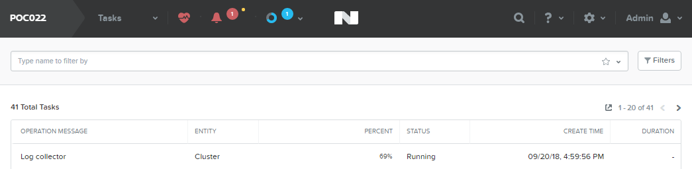

.. _ncc_ui:

------
NCC UI
------

Overview
++++++++

.. note::

  Estimated time to complete: **15 Minutes**

In this exercise you will use one of the common tools that can accelerate resolution of support cases: Nutanix Cluster Check (NCC).

Cluster Details
...............

Use you cluster that you reserved in the RX Manager.

References
..........

The following links are provided for reference and not required to complete the lab exercise.

- `Nutanix Cluster Check (NCC) 3.6 Guide <https://portal.nutanix.com/#/page/docs/details?targetId=NCC-Guide-NCC-v36:NCC-Guide-NCC-v36>`_

NCC
+++

**What is NCC?**

*Nutanix Cluster Check (NCC) is a framework of scripts that can help diagnose cluster health. NCC can be run provided that the individual nodes are up, regardless of cluster state. The health checks collect critical information regarding anomalies, Cassandra, data protection, hardware, hypervisor, network, Stargate, and more.*

**When would I run NCC?**

*As an SE, you would typically run NCC after a POC installation to ensure there are no immediate issues with the cluster, such as a misconfigured NTP server. Additionally, NCC should be run and the results attached to support cases. Providing this information proactively to support can often drastically reduce troubleshooting time.*

*All default checks are non-intrusive and can be run without concern for impacting the cluster.*

**You down with NCC?**

*Yeah you know me!*

------------

Log into **Prism** on your **POC** cluster.

Open **Prism > Health** and click **Actions > Run Checks**.

.. note::

  NCC can also be configured to run every 4 hours, daily, or weekly and the results will be e-mailed to all **E-mail Recipients** defined in **Alert E-mail Configuration** in cluster settings.

Select **All Checks**. De-select **Send the cluster check report in the email**. Click **Run**.

Select **Prism > Tasks** and wait for the **Health check** to reach 100%.

Click **Succeeded** under Status to view the report summary. Click **Download Output** for the details of any non-Passed tests.

Review the output and note specific KB articles are cited for common issues.

.. literalinclude:: ncc-output-example.txt
   :caption: Example NCC Output

The **ncc-output-YYYY-MM-DD-TIME.txt** file is what should be attached to new support cases.

Log Collector
+++++++++++++

**What is Log Collector?**

*Log Collector is an NCC plugin used to bundle logs present on the CVM. By default, all levels of logs are collected (INFO, ERROR, WARNING, FATAL). Refer to `KB1406 <https://portal.nutanix.com/#/page/kbs/details?targetId=kA0600000008cPfCAI>`_ for complete details on all services, alerts, and cluster configuration details collected.*

**When would I run Log Collector?**

*Log Collector bundles are critical for any offline analysis of a Support Case or Engineering ONCALL Case.*

*Log Collector is a resource intensive task. Running it for a long period might cause performance degradation on the Controller VM where you are running the Log Collector. Use caution if business needs require peak performance levels. In this case, run the Log Collector during a maintenance window if possible.*

*All logs gathered should be uploaded to the Support Case via https://portal.nutanix.com.*

------------

Log into **Prism** on your **POC** cluster.

Open **Prism > Health** and click **Actions > Log Collector**.

Select **Collect Logs starting now** and use the default collection period of 4 hours. Click **Run Now**.

.. note::

  Logs can also be collected from a custom date/time range, for example, if an issue occurred during the middle of the night but troubleshooting didn't begin until the following day. Logs can be collected covering a time period of 4 to 24 hours.

Select **Prism > Tasks** and wait for the **Log collector** to reach 100%.

Click **Succeeded** under Status to download the **NCC-logs-YYYY-MM-DD-TIME.tar** file.

.. note::

  By default, Log Collector does not anonymize (obscure) output for fields such as e-mail addresses, IP addresses, cluster name, etc.

  To obtain a Log Collector bundle with anonymized data, connect to any CVM via SSH and executing the following command:

  ``nutanix@CVM$ ncc log_collector --anonymize_output=True``

  Refer to `KB1406 <https://portal.nutanix.com/#/page/kbs/details?targetId=kA0600000008cPfCAI>`_ for complete details command line execution.
