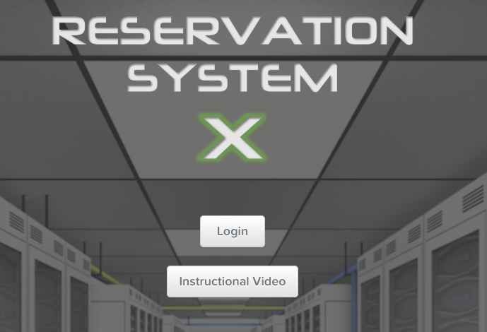

.. _snc_rx:

----------------------
RX Manager
----------------------

*Estimated time to complete:* **15 Minutes**

Overview
--------

HPOC (Hosted Proof Of Concept) environments are beng used for internal and external people that need resourecs to run tests, train themselves or as the name suggests for Proof of Concepts for customers during a sales cycle. During the NHT the HPOC environment has been mentioned, but no Hands-on have been run against it.

This module is to provide a Hands-on to get yourself ready to use the HPOC RX reservation manager, so you can reserve your own HPOC systems in the future.

.. note::
	
	You need to be on the Nutanix network to access the above link!

Documentation and Downloads
-----------

The total process and all background information can be found at https://confluence.eng.nutanix.com:8443/display/SEW/Hosted+POC+FAQ

Step by step guide
-----------

Follow these steps to get your SNC reserved and follow the rest of this workshop.

#. Open in a browser https://rx.corp.nutanix.com/ and click the **Login** button. Use your Okta login without the **\@nutanix.com** part.

#. If you haven't already logged in into Okta, you'll be presented with the Salesforce login page. Click on the **Okta** button to proceed to log in.
#. After you are loged in RX will show you your current reservations (if any).
#. Click on **New Reservation** in the top bar of the RX Manager UI
#. Select the **PHX-SingleNode** button to show all Singel Node Clusters in our  Phoenix Datacenter. Make sure the **Only Available** is selected. That way you only see the cluster that are available during the time that has been set (**From:** and the **TO:**)

	.. note::

		Make sure the timezone, right upper corner, is set to the right timezone!

#. Select one of the clusters that are shown by double clicking on the Green Bar. This will open a pop-up screen where the details can be set.
#. Set the details appropriate to your needs and click **Next**
   
   .. note::

   		If you want to share a cluster with a Nutanix Employee, fill out the **Share Reservation** field woth the email address of that person. That way two or more people will receive the invite and re-image messages that the RX Manager will send out.

#. In the next screen select your detailed settings for the cluster

     #) Hypervisor version
     #) AOS version
     #) CVM Memory
     #) Pre-defined password
        
#. Click the **Submit Reservation** button to make the reservation. Leave all other options empty as we are going to use the TE staging script to populate the needed.
   
   .. figure:: images/03.png

#. Select the **My Reservations** text to see the just created reservation in your list.
#. This screen shows the status of your reservation.

   .. figure:: images/04.png

   .. note::

   		The **Foundation Status** line shows the progress of the Foundation process of your reserved cluster. Before it hits 100% nothing can be done... Also the screen provides the password for your reservation so yu can login. 

#. After the foundation has run you can click on the **Cluster Name:** to go directly to the PRISM UI of your cluster.
   

This concludes the first part of the workshop. You now have a SNC to your disposal.

----

Take aways
----------

#. Use he RX Manager to quickly reserve a cluster
#. Have a clean cluster (SNC or 3/4 node cluster)
#. Set the needed Hypervisor and AOS version you need